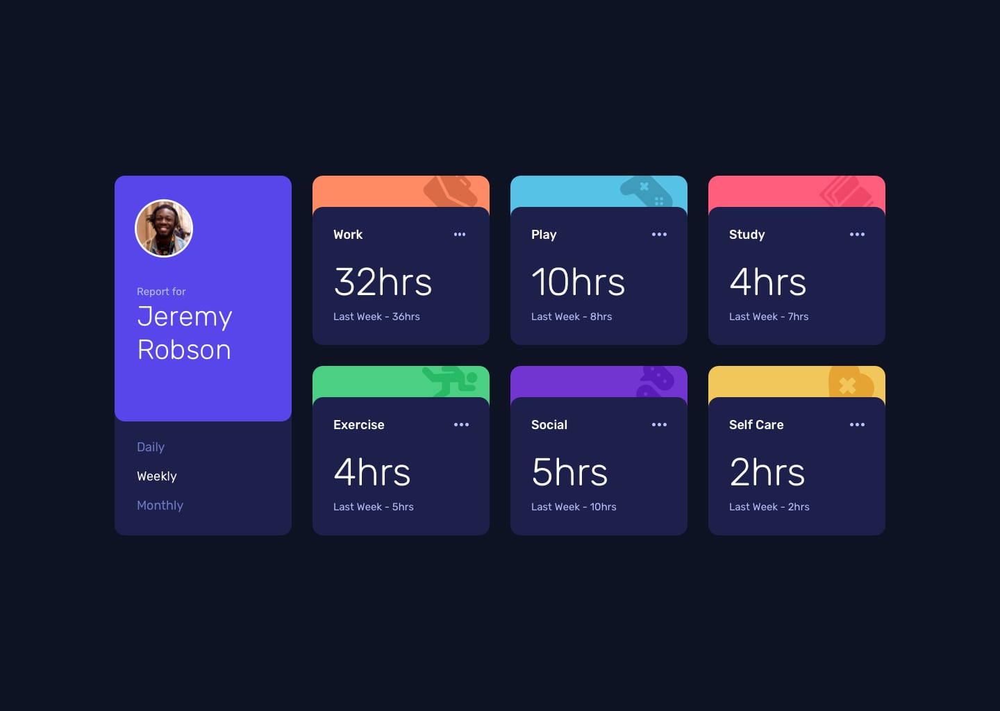

# Frontend Mentor - Time tracking dashboard solution

This is a solution to the [Time tracking dashboard challenge on Frontend Mentor](https://www.frontendmentor.io/challenges/time-tracking-dashboard-UIQ7167Jw). Frontend Mentor challenges help you improve your coding skills by building realistic projects. 

### The challenge

Users should be able to:

- View the optimal layout for the site depending on their device's screen size
- See hover states for all interactive elements on the page
- Switch between viewing Daily, Weekly, and Monthly stats

### Design

### Links

- Solution URL: [https://github.com/Polkan37/time-tracking-dashboard](https://github.com/Polkan37/time-tracking-dashboard)
- Live Site URL: [https://polkan37.github.io/time-tracking-dashboard](https://polkan37.github.io/time-tracking-dashboard)

